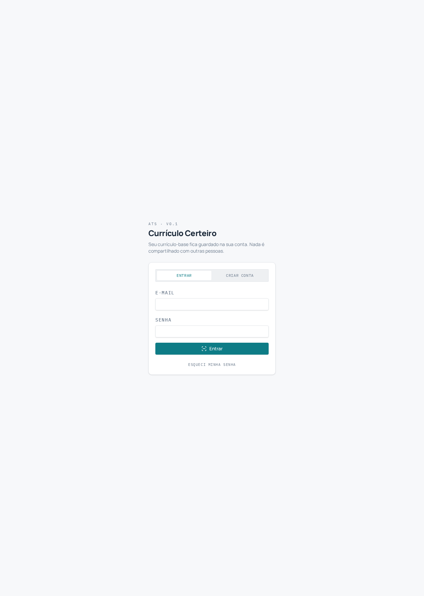
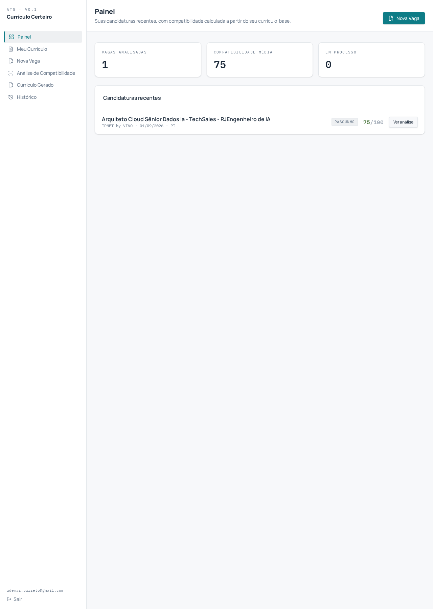
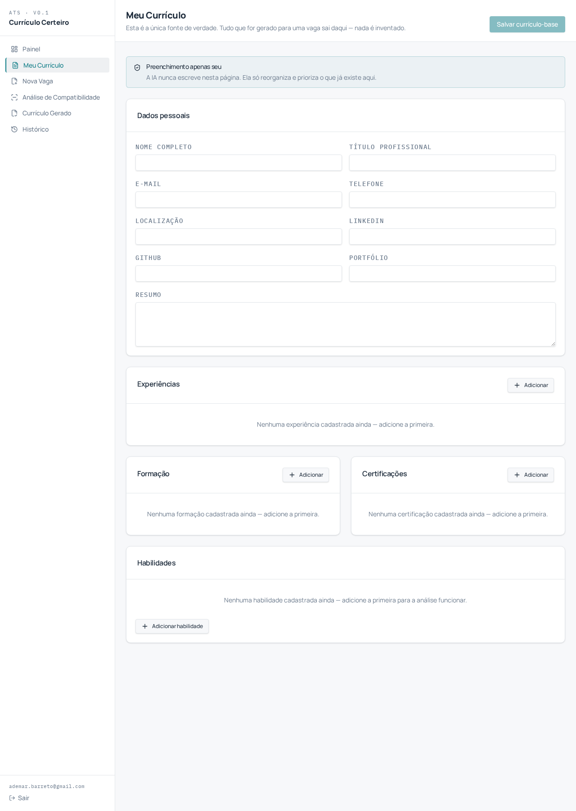
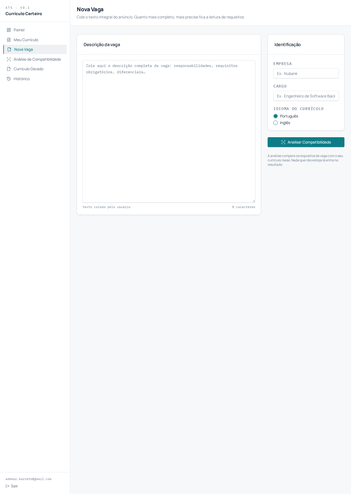
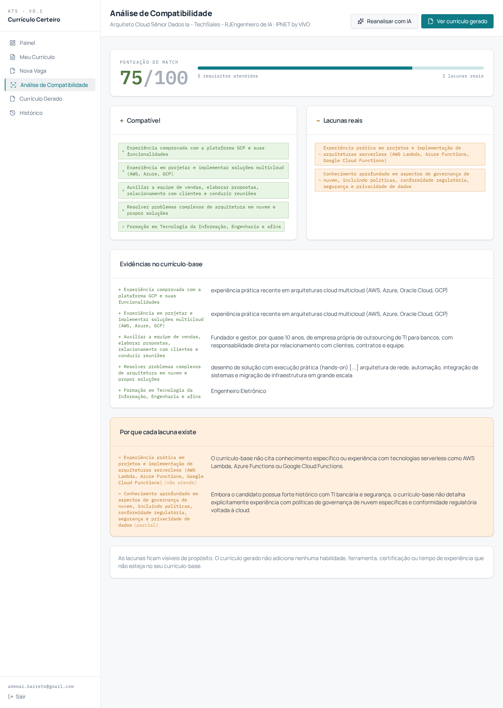
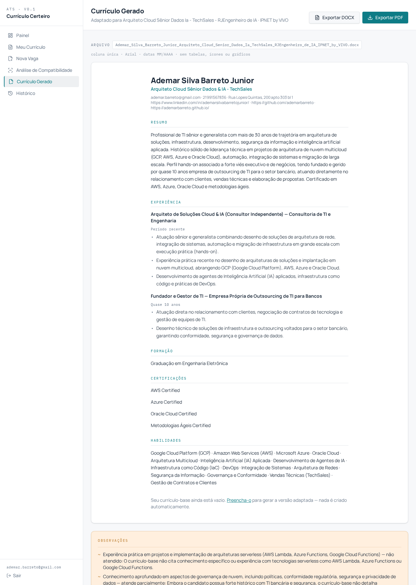
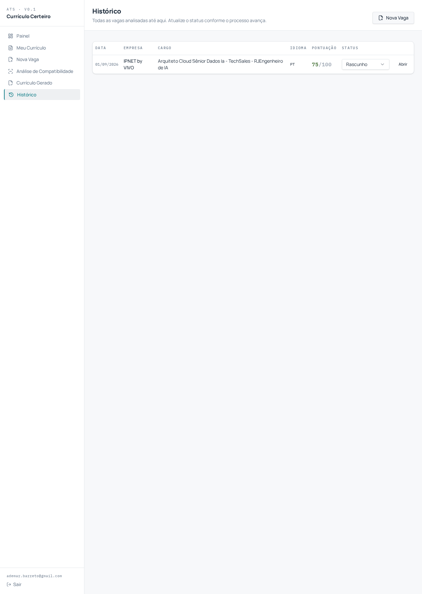
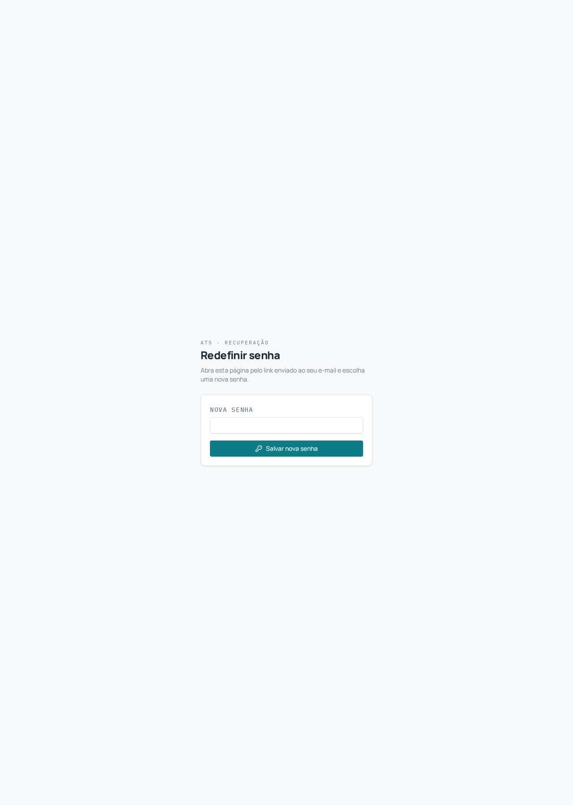
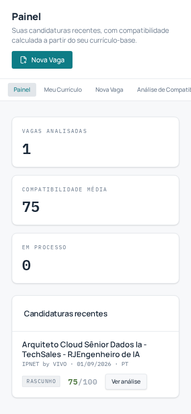

# Currículo Certeiro

<p align="center">
  
</p>

Gerador de currículos otimizados para ATS. O app compara o seu currículo-base com o texto de uma vaga específica, mostra honestamente o que combina e o que falta, e gera uma versão adaptada pronta para exportar em `.docx` e `.pdf`.

> **Regra inegociável:** a IA nunca inventa habilidade, ferramenta, certificação ou tempo de experiência que não esteja no currículo-base. Ela pode reordenar, reescrever para clareza e incorporar palavras-chave da vaga — nada além disso. Requisito não atendido vira lacuna, nunca é omitido.

---

## Acesso à aplicação

O app está no ar e pronto para uso — crie sua conta ou entre com seu e-mail:

[**Entrar — Currículo Certeiro**](https://curriculo-certeiro.lovable.app)

---

## Funcionalidades

- **Autenticação** por e-mail e senha, com criação de conta, confirmação de e-mail e recuperação de senha.
- **Currículo-base** estruturado: dados pessoais, experiências, formação, certificações e habilidades — preenchidos apenas por você.
- **Nova vaga**: cole a descrição do anúncio e a análise de compatibilidade roda automaticamente.
- **Análise com IA**: pontuação 0–100, requisitos atendidos com a evidência correspondente no currículo, lacunas classificadas (não atende / atende parcialmente) e currículo adaptado em coluna única.
- **Currículo gerado**: visualização do texto adaptado e exportação em `.docx` e `.pdf` no formato ATS.
- **Histórico** de vagas analisadas, com status editável (rascunho → aplicado → entrevista → rejeitado → aceito).
- **Estados vazios convidativos** em todas as listas, guiando para o primeiro passo.

---

## Telas da aplicação

Todas as capturas abaixo são do app rodando com dados reais. As imagens ficam em `docs/screens/`.

### 1. Entrar / Criar conta — `/auth`



A porta de entrada do app. Aba **Entrar** para quem já tem conta e **Criar conta** para novos usuários (com campo de nome completo). A confirmação de e-mail está ativa: clique no link recebido antes do primeiro login.

- Erros traduzidos para o português: credenciais inválidas, e-mail não confirmado, conta já existente e senha curta têm mensagens próprias.
- **Esqueci minha senha** envia um link de redefinição para o e-mail informado.

### 2. Painel — `/`



Visão geral da conta:

- **Cartões de estatística**: vagas analisadas, compatibilidade média e vagas em processo.
- **Candidaturas recentes**: as últimas 6 vagas com status, pontuação e atalho **Ver análise**.
- Botão **Nova Vaga** para começar uma análise imediatamente.
- Sem nenhuma vaga, um estado vazio convidativo mostra o caminho: *“Adicione a primeira vaga”*.

### 3. Meu Currículo — `/curriculo`



A **única fonte de verdade** do sistema. Nada é escrito pela IA nesta página — ela apenas reorganiza o que existe aqui.

- **Dados pessoais**: nome completo, título profissional, e-mail, telefone, localização, LinkedIn, GitHub, portfólio e resumo.
- **Experiências**: empresa, cargo, datas (fim vazio = emprego atual) e descrição, com botões para adicionar e remover.
- **Formação** e **Certificações**: entrada em bloco com emissor/instituição e períodos.
- **Habilidades**: nome + categoria (técnica, ferramenta ou soft skill).
- Botão **Salvar currículo-base** persiste tudo de uma vez — itens removidos são apagados, itens novos são inseridos.

### 4. Nova Vaga — `/nova-vaga`



- Textarea em fonte monoespaçada para colar o anúncio integral (com contador de caracteres).
- **Identificação**: empresa, cargo e idioma do currículo adaptado (Português ou Inglês).
- Botão **Analisar Compatibilidade** dispara a análise com IA na hora — o resultado cai direto na tela de análise.

### 5. Análise de Compatibilidade — `/analise`



O coração do produto, em três blocos:

- **Pontuação de match** (0–100) com barra de progresso e contagem de requisitos atendidos × lacunas.
- **+ Compatível** (verde-sálvia): requisitos da vaga atendidos pelo currículo-base.
- **~ Lacunas reais** (âmbar): requisitos não atendidos — nunca omitidos.
- **Evidências no currículo-base**: para cada requisito atendido, o trecho exato do currículo que o comprova.
- **Por que cada lacuna existe**: explicação do que falta, marcada como *(parcial)* ou *(não atende)*.
- Botões **Reanalisar com IA** e **Ver currículo gerado**.

### 6. Currículo Gerado — `/curriculo-gerado`



- Pré-visualização do currículo adaptado em **coluna única**, com nome, contato, resumo, experiências, formação, certificações e habilidades.
- Botões **Exportar DOCX** e **Exportar PDF** com nome de arquivo no padrão `Nome_Sobrenome_Cargo_Empresa`.
- Painel **Observações** listando as lacunas que não entraram no corpo do currículo — transparência total.

### 7. Histórico — `/historico`



Todas as vagas analisadas em tabela: data, empresa, cargo, idioma, pontuação e **status editável** (dropdown direto na linha, com toast de confirmação). Cada linha abre a análise completa.

### 8. Redefinir senha — `/redefinir-senha`



Aberta pelo link enviado por e-mail. Se a sessão de recuperação for válida, mostra o formulário **Nova senha**; caso contrário, avisa que o link é inválido ou expirado e oferece voltar para o login.

### Responsividade



No mobile a sidebar vira uma barra de navegação horizontal no topo, e os cartões empilham verticalmente.

---

## Fluxo de uso

```text
1. Criar conta em /auth e confirmar o e-mail
2. Preencher o currículo-base em /curriculo  (fonte da verdade)
3. Colar a descrição da vaga em /nova-vaga   (análise roda sozinha)
4. Revisar /analise: o que combina, o que falta e por quê
5. Exportar o currículo adaptado em /curriculo-gerado (.docx ou .pdf)
6. Acompanhar o processo em /historico, atualizando o status
```

## Exportação compatível com ATS

- Coluna única, sem tabelas, caixas de texto, ícones ou elementos gráficos.
- Fonte padrão (Arial no DOCX, Helvetica no PDF), texto em preto.
- Títulos convencionais: Resumo Profissional, Experiência Profissional, Formação Acadêmica, Certificações, Habilidades.
- Datas normalizadas em MM/AAAA — aceita entradas como `2021-03`, `mar/2021`, `2015` e `atual`.
- Marcadores simples com hífen, sem símbolos decorativos.
- Arquivo nomeado `Nome_Sobrenome_Cargo_Empresa.docx` / `.pdf`.

## Autenticação

- Crie a conta na aba **Criar conta** da tela `/auth`. A confirmação de e-mail está ativa: clique no link recebido antes do primeiro login.
- **“Invalid login credentials”** significa e-mail ou senha incorretos, ou conta ainda não criada. A interface traduz isso para o português com instruções claras.
- Esqueceu a senha? Informe o e-mail na tela de login e clique em **Esqueci minha senha** — o link de redefinição chega por e-mail.

## Design

Estilo editorial-técnico (ficha técnica / scanner):

- **Manrope** na interface, **IBM Plex Mono** em dados processados (pontuações, datas, tags técnicas).
- Paleta em **teal profundo** (#0E7C86), **verde-sálvia** (#4F7942) e **âmbar** (#B8792A), com superfícies claras e cantos retos.
- Tags de análise com animação de varredura (`scan-in`) e rótulos em caixa alta monoespaçada (`label-tech`).
- Todos os valores são tokens semânticos em `src/styles.css` — nada de cores hardcoded nos componentes.

## Stack

- TanStack Start (React 19, Vite 7) com rotas em `src/routes`
- Tailwind CSS v4 + shadcn/ui
- Lovable Cloud (banco Postgres com RLS, autenticação e storage)
- Server functions (`createServerFn`) para a análise de IA via Lovable AI Gateway (modelo Gemini)
- `docx` e `jspdf` para exportação

## Estrutura

```text
src/
  routes/                 páginas (auth, redefinir-senha, _authenticated/*)
  components/             app shell, estados vazios, tags técnicas
  lib/
    dados.ts              consultas e mutações (TanStack Query)
    dominio.ts            tipos de domínio e rótulos
    analise.ts            comparação determinística por palavras-chave
    analise-ia.functions.ts  server function da análise com IA
    exportar-curriculo.ts    geração de DOCX e PDF em formato ATS
  integrations/supabase/  clientes e middlewares gerados
docs/
  screens/                capturas das telas usadas neste README
```

## Modelo de dados

`profiles`, `experiences`, `education`, `certifications`, `skills`, `job_postings` e `matches` — todas vinculadas ao usuário autenticado, com RLS garantindo que cada pessoa veja apenas os próprios dados. A tabela `matches` guarda pontuação, habilidades compatíveis, lacunas, evidências, explicações e o currículo adaptado gerado pela IA.

## Desenvolvimento local

```sh
git clone <url-do-repositorio>
cd <pasta-do-projeto>
npm i
npm run dev
```

---

## Apêndice — Kit de Prompts para o Lovable

Documento usado para construir o Currículo Certeiro no Lovable: 4 prompts para colar **um de cada vez, nessa ordem**. A documentação oficial do Lovable é consistente nesse ponto: um prompt único gigante tentando construir tudo de uma vez costuma sair pior — o modelo se perde em detalhes secundários e você acaba corrigindo mais do que teria escrito num prompt enxuto. Um prompt de fundação bem definido, seguido de prompts focados para cada capacidade nova (banco de dados, IA, exportação), constrói mais rápido e com menos retrabalho de créditos.

> Copie só o texto de dentro de cada bloco cinza abaixo (sem os três acentos graves) e cole no chat do Lovable.

### Prompt 1 — Fundação do app

*Cole primeiro. Revise o preview antes de seguir para o Prompt 2.*

```
Crie um aplicativo web chamado "Currículo Certeiro" — um gerador de currículos otimizados para ATS (Applicant Tracking System) que compara o currículo do usuário com uma vaga específica e gera uma versão adaptada para aquela vaga, mostrando com honestidade o que combina e o que falta. Público: profissionais que aplicam para várias vagas ao mesmo tempo e querem um currículo relevante para cada uma, sem inventar experiência que não têm. Ação principal: colar o texto de uma vaga e receber uma análise de compatibilidade mais um currículo adaptado, pronto para exportar.

Modelo de dados:
- profiles: nome_completo, titulo_profissional, email, telefone, localizacao, linkedin_url, github_url, portfolio_url, resumo (texto longo)
- experiences: empresa, cargo, data_inicio, data_fim (vazio se for o emprego atual), descricao (texto longo)
- education: instituicao, curso, data_inicio, data_fim
- certifications: nome, emissor, data_emissao, data_validade
- skills: nome, categoria (técnica | ferramenta | soft skill)
- job_postings: empresa_vaga, cargo_vaga, descricao_vaga (texto longo colado pelo usuário), idioma (pt | en)
- matches: referência à vaga, pontuacao (0 a 100), habilidades_compativeis (lista), lacunas_reais (lista), curriculo_adaptado (texto), status (rascunho | aplicado | entrevista | rejeitado | aceito)

Páginas, no menu lateral:
1. Painel — candidaturas recentes com pontuação e status; atalho para "Nova Vaga"
2. Meu Currículo — formulário com dados pessoais, experiências, formação, certificações e habilidades. É a única fonte de verdade: nada aqui é preenchido pela IA
3. Nova Vaga — campo grande para colar a descrição da vaga, mais empresa e cargo; botão "Analisar Compatibilidade"
4. Análise de Compatibilidade — pontuação, tags de habilidades compatíveis e tags de lacunas reais lado a lado, em estilo de diff de código (não um gauge circular genérico): tags monoespaçadas, verde-sálvia com "+" para o que combina, âmbar com "~" para o que falta. Nesta primeira versão use dados de exemplo fixos para validar o layout — a análise real por IA entra num próximo prompt
5. Currículo Gerado — preview do currículo adaptado em coluna única, com uma seção "Observações" listando as lacunas com honestidade. Botões de exportar visíveis, ainda sem função
6. Histórico — tabela de todas as vagas analisadas, com status editável

Estilo visual: preciso, editorial-técnico, confiável — o oposto do SaaS genérico roxo-gradiente. Pense em "ficha técnica encontra scanner de código". Use shadcn/ui para todos os componentes.

Cores (tokens do tema, modo claro): fundo #F7F8FA, texto #1C2A3A, primária #0E7C86 (teal profundo, para ações e nav ativo), sucesso/compatível #4F7942 (verde-sálvia), atenção/lacuna #B8792A (âmbar), crítico #9C3F2E (vermelho-tijolo escuro), bordas e fundos secundários #E2E6EA.

Tipografia: Manrope em toda a interface; IBM Plex Mono só na pontuação de match, nas tags de habilidades e no nome do arquivo exportado — reforça a diferença entre o "dado processado" e o texto humano do currículo.

Uma única animação: ao carregar o resultado da análise, as tags de compatibilidade e lacunas aparecem em sequência curta, como uma varredura. Nenhuma outra animação decorativa.

Interface em português do Brasil. Responsivo, mas priorize desktop — o uso principal é preencher formulários longos. Estruture as telas já assumindo um usuário autenticado; a autenticação real entra no próximo prompt.

Regra inegociável do produto: o currículo gerado nunca pode conter habilidade, ferramenta, certificação ou tempo de experiência que não esteja no currículo-base do usuário. O que falta vira lacuna visível, nunca é inventado ou escondido.

Não implemente ainda: login e banco de dados reais, chamada de IA real, exportação real de arquivo, múltiplos usuários, pagamento.
```

### Prompt 2 — Backend e autenticação

*Cole depois que o Prompt 1 estiver de pé e você tiver ativado o backend (Cloud) do projeto no Lovable.*

```
Ative o backend nativo (Cloud/Supabase) deste projeto. Adicione autenticação por e-mail e senha. Crie as tabelas do modelo de dados já definido — profiles, experiences, education, certifications, skills, job_postings, matches — todas vinculadas ao usuário autenticado, com políticas RLS garantindo que cada pessoa veja só os próprios dados. Troque os dados de exemplo das telas por dados reais do banco. Em cada lista vazia, mostre um estado vazio convidativo (ex.: "Nenhuma vaga analisada ainda — adicione a primeira") em vez de uma tela em branco.
```

### Prompt 3 — Lógica de IA (match + geração ATS)

*O coração do produto. Cole depois que login e banco estiverem funcionando.*

```
Adicione a lógica real de IA à tela de Análise de Compatibilidade, usando uma Edge Function que chama uma API de LLM (ex.: OpenAI, ou os recursos de IA nativos do Lovable). Ao clicar em "Analisar Compatibilidade", a função recebe o currículo-base estruturado do usuário e o texto da vaga, e devolve em JSON: pontuação de 0 a 100, lista de habilidades/requisitos atendidos com a evidência correspondente no currículo, lista de lacunas reais (requisitos da vaga que o candidato não atende ou atende parcialmente) e uma versão adaptada do currículo em formato ATS de coluna única.

Regra inegociável para o prompt da IA: nunca adicionar habilidade, ferramenta, certificação ou tempo de experiência que não exista no currículo-base. A IA pode reordenar, reescrever para clareza e incorporar naturalmente as palavras-chave da vaga — nunca inventar. Requisito não atendido vai para a lista de lacunas, nunca é omitido.

Salve o resultado na tabela matches e exiba as tags de compatibilidade e lacunas no estilo de diff já definido na primeira versão.
```

### Prompt 4 — Exportação em DOCX/PDF

*Cole por último.*

```
Adicione exportação do currículo gerado em .docx e .pdf, seguindo regras de compatibilidade com ATS: layout de coluna única; sem tabelas, caixas de texto, ícones ou elementos gráficos; fonte padrão (Arial, Calibri ou Times New Roman); títulos de seção em texto simples com nomenclatura convencional (Experiência Profissional, Formação Acadêmica, Habilidades, Certificações); datas em formato MM/AAAA; marcadores simples, sem símbolos decorativos. Nome sugerido do arquivo: Nome_Sobrenome_Cargo_Empresa.docx. O botão de exportar fica na tela Currículo Gerado, já posicionado no Prompt 1.
```

### Dicas rápidas para o Lovable

- Cole um prompt de cada vez e confira o preview antes de seguir para o próximo.
- Ajuste visual pequeno (cor de um botão, espaçamento, texto de um rótulo) → use o **Visual Edits**, não consome créditos.
- Decisão maior (nova tabela, mudar a abordagem de alguma tela) → discuta primeiro no **Chat/Plan Mode** antes de gerar código.
- Antes de publicar, rode o **Security Scan** nativo do Lovable — importante porque o app vai guardar currículos e dados pessoais reais.
- Se um prompt sair muito torto, restaure a versão anterior no histórico em vez de tentar consertar por cima.

### Ideias para depois (fora do escopo inicial)

- Carta de apresentação gerada junto com o currículo, alinhada à vaga
- Importar o perfil a partir de um PDF de currículo existente
- Currículo em inglês quando a vaga estiver em inglês — tradução fiel do conteúdo real, não geração nova
- Painel com taxa de retorno por tipo de vaga ou empresa